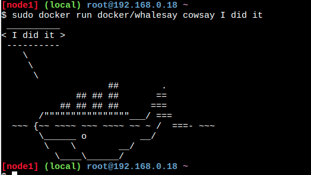

# Intro-Github

 Sesion Github

Taller desarrollado por el **Google Developer Student Club de la Universidad de Guanajuato** en colaboración por parte del programa _**SKILLS FOR WOMEN IN TECH**_ y junto a **BRITISH COUNCIL** para la capacitacion-actualización de un grupo de estudiantes y profesores de la casa de estudios.

### Insertaremos una imagen

NewBranch_IntroGithub
## Aqui añadimos mas informacion

En esta rama añandimos informacion diferente

### Agregamos mas informacion

Esta es una prueba y practica de las cosas que podemos hacer en github

